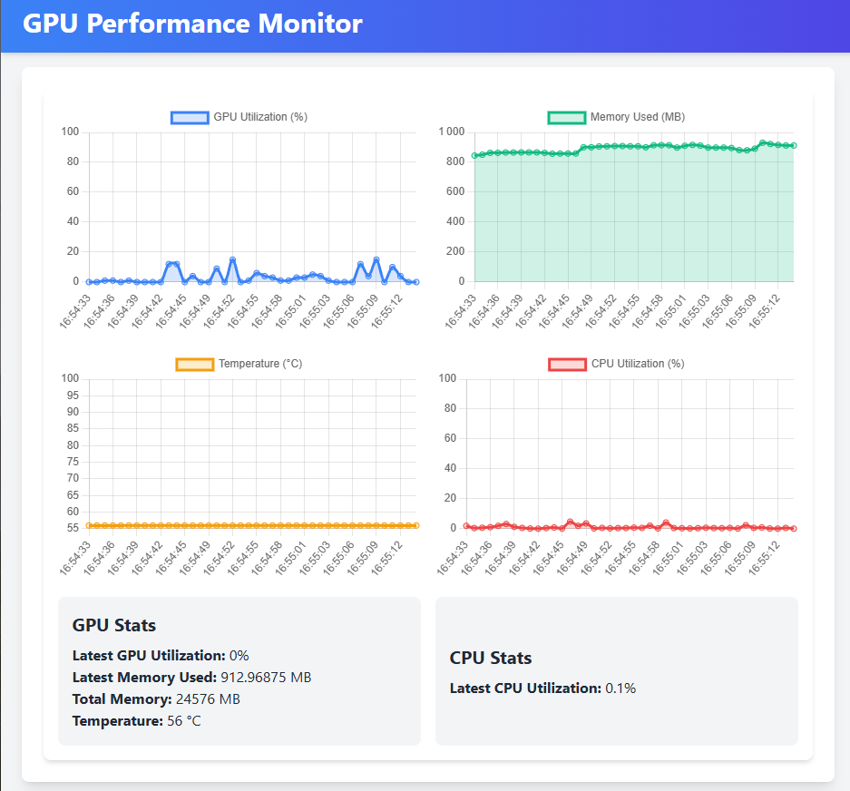

# GPU & CPU Performance Monitor 🚀

A simplified, lightweight tracker for the RTX 3090 and your CPU, providing real-time visualizations of GPU and CPU metrics 📊.

## Features ✨

- 📈 **Real-time monitoring** of:
  - GPU utilization
  - GPU memory usage
  - GPU temperature
  - CPU utilization
- 📊 **Interactive chart visualizations** for easy insights!



## Getting Started 🛠️

### Prerequisites ✅

- Docker and Docker Compose installed 🐳.
- NVIDIA drivers and NVIDIA Container Toolkit installed 🔧.

### Setup Instructions 🚀

1. **Clone the repository**:

   ```bash
   git clone https://github.com/louispaulet/gpu_monitoring
   cd gpu-performance-monitor
   ```

2. **Start the services** with Docker Compose:

   ```bash
   docker-compose up
   ```

3. Open your browser and visit `http://localhost:3000` to see real-time GPU and CPU stats!

---

Now you're all set to visualize your hardware performance like a pro! 🖥️📈

Happy monitoring! 😎